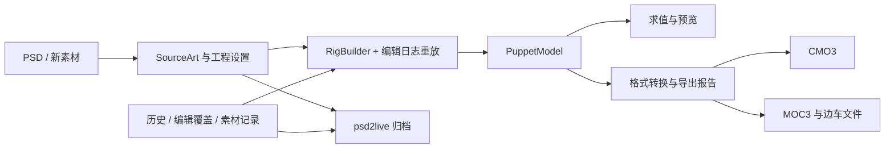

# 工程、运行时与导出边界

[文档目录](../../README.md) · [工程格式](PROJECT_FORMAT.md) · [实现导览](IMPLEMENTATION_COMPARISON.md)

按当前源码整理。解析器存在某个类型、保留原文件未知字段、能够在 UI 编辑，以及在目标软件中效果一致，是四种不同的支持程度。

独立 Warp 的普通及混合形几何迁移由共享核心编辑执行；应用层在候选模型中解析共同父级并保存有序日志。局部拟合覆盖叠加混合形包络，保留默认关键形参考，防止只缩放普通关键形而改变动画。旧静态 Warp 记录仍可重放；任务和原子批量使用同一提交边界。实测与未完成范围见 [重构进度](../agent/REFACTOR_PROGRESS.md)。

## 数据流

| 层 | 主要对象 | 职责 |
| --- | --- | --- |
| 工程 | `SourceArt`、`WorkspaceDocument`、历史和素材库 | 保存源像素、分类、配置、结构与可重放编辑 |
| 运行时 | `PuppetModel` | 参数、Part、Warp / Rotation、ArtMesh、Glue、关键形、通道与绘制关系 |
| 格式 | `Cmo3Model`、`MocDocument` | 编辑器对象图与运行时文件结构 |
| 求值与交付 | CPU / 原生预览、转换器、Pipeline、Sidecars | 采样、渲染、输出文件族与损失诊断 |

PSD 导入与图片工程创建共用独立应用层 `WorkspaceSourceImporter`，读取前捕获状态，清除旧工程覆盖后重建并 CAS 安装新 ID/加载代次。GUI 分析负责可信调用和投影，MCP 返回进程任务；未保存切换默认拒绝、明确放弃后才允许替换，任务取消不能将已安装结果报告为回滚。

工程重开会重建 Rig 并重放编辑。新功能若只改 `PuppetModel` 而没有进入源工程或持久化编辑日志，重建后会丢失。画布、MCP 与保存流程都必须遵守这个边界。

### Cubism 对应字段的权威格式

与 Cubism 一一对应的可编辑数据，以 Cubism 的单位、范围和语义作为唯一权威格式；创建设置、模型、编辑日志、检视面板与导出共享该格式。算法需要的局部坐标、归一化比例等只在计算边界临时转换，不作为另一份编辑状态保存。

变形路径的 `width` 直接对应 CMO3 `lineWidth`，是画布像素中的影响半径，默认 `50`；`hardness` 直接对应 `lineHardnessPercent`，范围 `0–100`，默认 `50`。创建过程不再根据网格尺寸乘百分比推算半径。闭合状态、角点和编辑层级保留其既有语义映射。

新路径日志带 `path_units: "cubism"`。读取不带该标记的旧日志时，将局部半径沿父变形器链转换为画布半径，将旧硬度比例乘以 `100`；重新编码后使用权威格式，避免重复转换。CMO3 导入与导出直接读写原生半径和硬度数值。

## 当前产品入口

主画布已提供选择、形变、网格拓扑、变形器创建、Glue、路径和绘画会话。参数、检视、动画和物理面板提供相应控制。

GUI 与 MCP 当前处于应用层重构迁移阶段，参数公开 `parameter_create/update/delete`，骨架与动作片段使用 `skeleton_* / motion_*`，既有源图层分类使用 `layer_classify`，画布结构与拓扑使用 `canvas_* / rig_edit_structure`，工程设置与模型导出使用 `settings_update / project_export_model`，模型预设使用 `model_apply_preset`。素材支持 PSD 导入、CMO3 新建/替换导入、图片工程创建与源图绘画；`source_get_components` 查询当前连通块，`source_split_components/source_split_polygon` 为后台和批量操作。GUI 连通块对话框与 MCP 共用独立候选/重建/CAS，稳定身份和生成输入可保存重放；目标已有编辑绑定的分区仍拒绝，完整迁移尚待完成。`source_split_depth` 与 GUI 共用应用候选、后台任务及原子批量，复制当前所选网格的运动、路径和权重，方向 Glue 保持原后层运动；固定两层绘制顺序，嘴部不再额外生成嘴唇。历史重放、保存重开及 CMO3 运动/Glue 读回已有回归，导入 CMO3 深度拆分不支持。另有逐图层网格配置、预览参数会话与 PSD 导出。低层对象方法不能自动视为公开接口。详见 [MCP 契约](../agent/MCP_AUTHORING.md)。

`org.umamo.edit` 的通用编辑会话也不是 PSD2Live 历史的唯一权威入口。接入底层编辑能力时，需要转换为工作区可保存、可重放的操作。

## 格式支持范围

| 内容 | 当前能力 | 需要区分的边界 |
| --- | --- | --- |
| 网格、Warp / Rotation、参数、普通关键形 | 核心模型、编辑与导出 | 跨父级换绑不等于全运动保真；源图 / 参数配置影响生成结果 |
| 颜色、透明度、绘制顺序、遮罩 | 模型与编辑通道 | 目标版本和格式表达能力可能带来降级 |
| Glue | 模型、可视创建与关键形 | 不等于完整的权重刷、配对修复工具链 |
| Blend Shape、Part 绘制组等 | 底层模型与格式映射 | 完整产品编辑工作流仍有缺口 |
| 变形路径 | 工作区编辑、CMO3 控制器、MOC3 烘焙 | 单 ArtMesh；未宣称与官方编辑算法一致 |
| 物理 | 统一的物理组目录（预设 / 骨骼 / 摆动 / 自定义，可修改、关闭、恢复、调整计算顺序），多输入多输出与 1–16 个摆锤，计算 FPS，physics3.json 导入，输入与摆锤预置，面板可视化编辑，MCP `physics_put/delete/simulate/fit/config/import`、`physics_audition*` 试听与 `physics_preset_*` 预置，软件预览按 Cubism 求值 | 输入 / 输出类型限位置X 与角度（CMO3 支持的范围），不含风力等全局物理设置 |
| 动作 | 基础动作生成与播放 | 不等于通用动作时间轴编辑 |
| Expression / Pose / UserData | 格式 / 边车层有相应处理 | 不能把透传当作完整可编辑工程资产 |
| ArtPath、Motion Sync、扩展插值与部分编辑器元数据 | 类型或原对象图可能存在 | 不能据此宣称从 PSD 可创建或完整语义编辑 |

CMO3 新建及替换导入共用应用层 `WorkspaceCmo3Importer`：从文件准备可重建的源图和导入 Rig，不套用 PSD 自动 Rig 或动作预设；替换按 ID 更新、保留未出现对象，文档和姿态重置一次 CAS。GUI 与 MCP 调用同一源图能力，MCP 导入使用进程任务。支持范围仍受统一模型及转换器约束。

CMO3 的格式库可以保留原对象图中的部分未知信息，但从 PSD 新建 CMO3 时只能合成已建模的数据。这是格式库能力，不代表主程序可直接打开所有 CMO3 工程。MOC3 由统一模型合成，不能依赖同样的未知字段透传。

## 文件族与验收

`.moc3` 不包含全部运行配置。贴图、`.model3.json`、显示信息、物理和动作等由边车文件共同表达，是否输出取决于设置及模型参数。

流水线检查中立、头部姿态、方向性变形器及格式读回，输出诊断和警告。文件存在只说明写出成功；还需检查报告、目标版本剥离及实际视觉效果。正式交付应在目标运行时加载整个文件族，并在目标编辑器检查需要继续编辑的 CMO3。

## 后续工作

重点包括统一边车资产模型、完整 Blend Shape / Glue 编辑、扩展插值、更多物理结构、导出损失的一致展示与真实兼容性样本。产品计划在[路线图](../ROADMAP.md)维护，不在此复制未验证完成状态。

新增功能至少覆盖：领域数据 → 历史重放 → 工程保存恢复 → 目标版本处理 → 导出读回 → 视觉检查。只有测试实际覆盖的范围才能写成兼容性结论。

源码：[工程](../../../src/main/kotlin/io/github/psd2live/project/) · [核心流水线](../../../src/main/kotlin/io/github/psd2live/core/) · [运行时](../../../umamo/src/main/kotlin/org/umamo/runtime/) · [格式转换](../../../umamo/src/main/kotlin/org/umamo/interop/)。

文件图片放置的 GUI 预览、确认和取消已进入独立应用会话，与 `layer_set_bounds/layer_cancel_import` 共用文档候选。预览不改持久源图，保存等待确认；定位保留身份、实际父级和原生成帧，重复缩放读取保存的原像素。自建父级的后续网格重生使用同一核心中性坐标转换。完整源图/分类迁移及其余 GUI 业务验收仍见重构进度。
